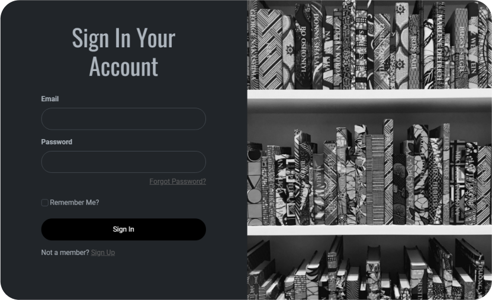
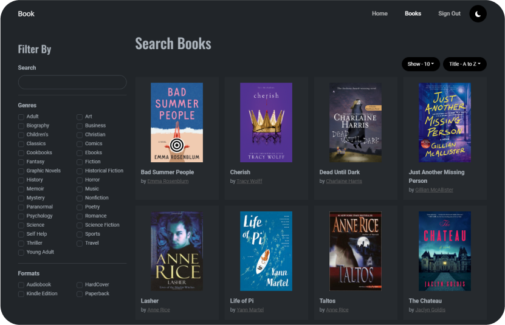

# Book Web App

Small book app with user management and book search system.

## Features
* Book search by authors, genres, formats.
* Pagination and sorting features are supported for the book search.
* Authentication and Authorization.
* Light and dark theme support.

## Preview

 

  
   
   
  
   
   
  
   
   
  
   

## Tech Stack

### Frontend
* [![VSCode][VSCode]][VSCode-url]
* [![SCSS][SCSS]][SCSS-url]
* [![Bootstrap][Bootstrap]][Bootstrap-url]
* [![ReactJS][ReactJS]][ReactJS-url]
* [![JavaScript][JavaScript]][JavaScript-url]
* [![Redux][Redux]][Redux-url]

### Backend
* [![VisualStudio][VisualStudio]][VisualStudio-url]
* [![Csharp][Csharp]][Csharp-url]
* [![.Net][.Net]][.Net-url]
* [![JWT][JWT]][JWT-url]
* [![MicrosoftSQLServer][MicrosoftSQLServer]][MicrosoftSQLServer-url]

### Deployment
* [![YAML][YAML]][YAML-url]
* [![Azure][Azure]][Azure-url]

## Acknowledgments
* [Img Shields](https://shields.io)
* [Microsoft Learn](https://dotnet.microsoft.com/en-us/learn/aspnet)
* [Code Maze](https://code-maze.com/)
* [Learn Entity Framework Core](https://www.learnentityframeworkcore.com)
* [RTK Query](https://redux-toolkit.js.org/rtk-query/overview)

<!-- MARKDOWN LINKS & IMAGES -->
<!-- https://www.markdownguide.org/basic-syntax/#reference-style-links -->

[VSCode]: https://img.shields.io/badge/Visual%20Studio%20Code-0078d7.svg?style=for-the-badge&logo=visual-studio-code&logoColor=white
[VSCode-url]: https://code.visualstudio.com
[SCSS]: https://img.shields.io/badge/SASS-hotpink.svg?style=for-the-badge&logo=SASS&logoColor=white
[SCSS-url]: https://sass-lang.com
[Bootstrap]: https://img.shields.io/badge/Bootstrap-563D7C?style=for-the-badge&logo=bootstrap&logoColor=white
[Bootstrap-url]: https://getbootstrap.com
[ReactJS]: https://img.shields.io/badge/React-20232A?style=for-the-badge&logo=react&logoColor=61DAFB
[ReactJS-url]: https://reactjs.org
[JavaScript]: https://img.shields.io/badge/javascript-%23323330.svg?style=for-the-badge&logo=javascript&logoColor=%23F7DF1E
[JavaScript-url]: https://developer.mozilla.org/en-US/docs/Web/JavaScript
[Redux]: https://img.shields.io/badge/redux-%23593d88.svg?style=for-the-badge&logo=redux&logoColor=white
[Redux-url]: https://redux.js.org

[VisualStudio]: https://img.shields.io/badge/Visual%20Studio-5C2D91.svg?style=for-the-badge&logo=visual-studio&logoColor=white
[VisualStudio-url]: https://visualstudio.microsoft.com/vs
[Csharp]: https://img.shields.io/badge/c%23-%23239120.svg?style=for-the-badge&logo=c-sharp&logoColor=white
[Csharp-url]: https://dotnet.microsoft.com/en-us/languages/csharp
[.NET]: https://img.shields.io/badge/.NET-5C2D91?style=for-the-badge&logo=.net&logoColor=white
[.NET-url]: https://dotnet.microsoft.com/en-us
[JWT]: https://img.shields.io/badge/JWT-black?style=for-the-badge&logo=JSON%20web%20tokens
[JWT-url]: https://jwt.io
[MicrosoftSQLServer]: https://img.shields.io/badge/Microsoft%20SQL%20Server-CC2927?style=for-the-badge&logo=microsoft%20sql%20server&logoColor=white
[MicrosoftSQLServer-url]: https://www.microsoft.com/en-us/sql-server/sql-server-downloads

[YAML]: https://img.shields.io/badge/yaml-%23ffffff.svg?style=for-the-badge&logo=yaml&logoColor=151515
[YAML-url]: https://yaml.org
[Azure]: https://img.shields.io/badge/azure-%230072C6.svg?style=for-the-badge&logo=microsoftazure&logoColor=white
[Azure-url]: https://azure.microsoft.com